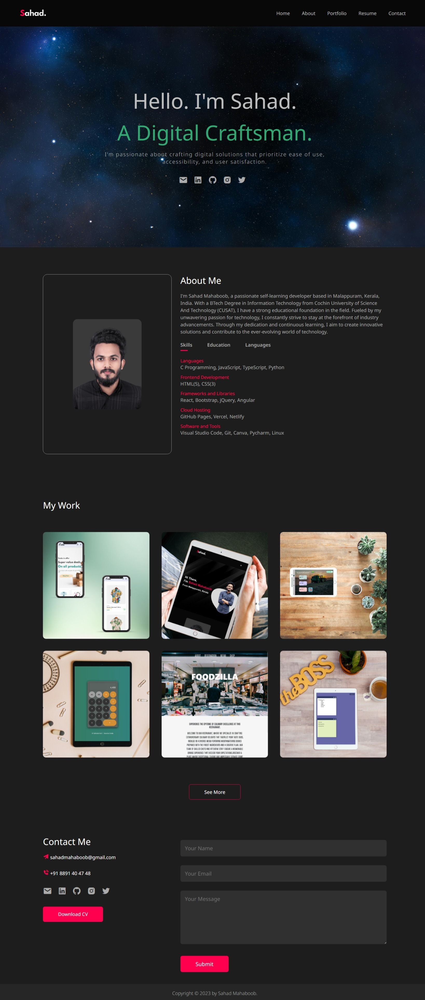

     

<h1 align = "center"><b>Personal Portfolio</b></h1> 

 
    <a href="https://sahadcmd.github.io/Portfolio/" target="_blank">Visit Website!</a>
    ·
    <a href="https://github.com/sahadcmd/Portfolio/issues" target="_blank">Report Bug</a>

 

  
## About this project 🚀 

Experience the full range of my skills, explore my diverse portfolio of projects, and delve deeper into my professional journey through a captivating personal website that offers an immersive glimpse into who I am and what I bring to the table.

This website gives a seamless accessibility experience across various devices, from mobile phones to tablets, as it effortlessly adapts to different screen sizes.

 
## Technologies 🛠️ 

* `HTML`
* `CSS`
* `JavaScript`
* `jQuery`
* `Bootstrap`

## How it looks 📷

    

 

    

<h5 align="center">Connect with me!</h5> 

    <a href="https://www.linkedin.com/in/sahadmahaboobp" target="_blank">LinkedIn</a>

